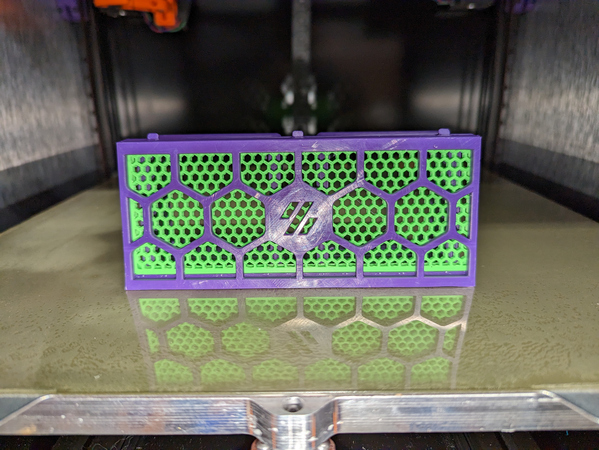
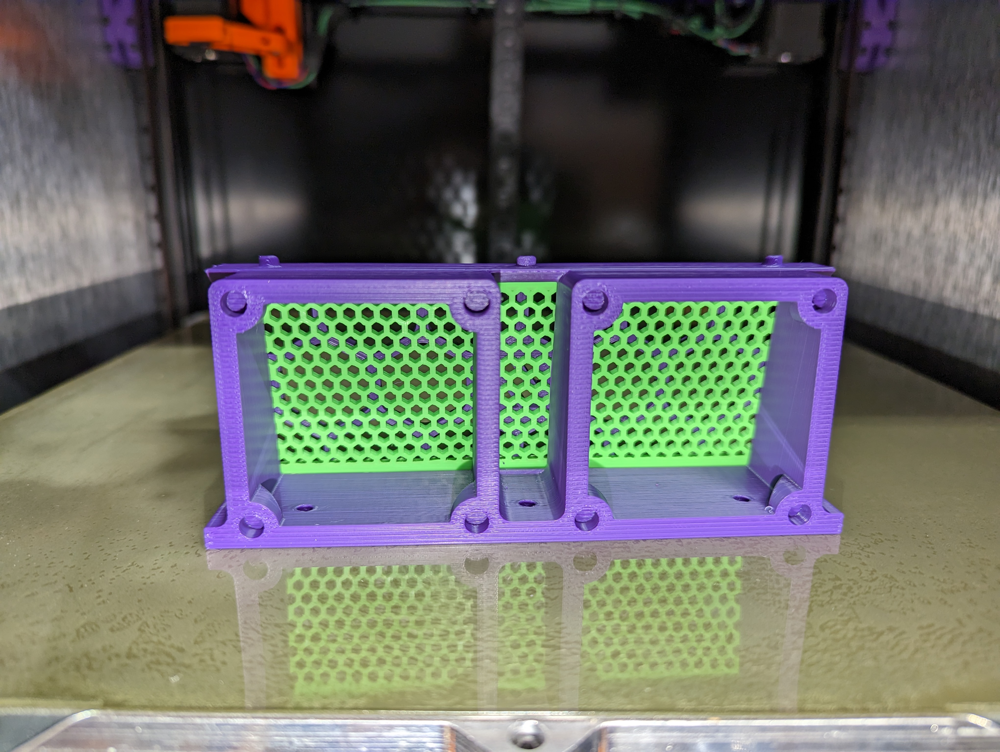
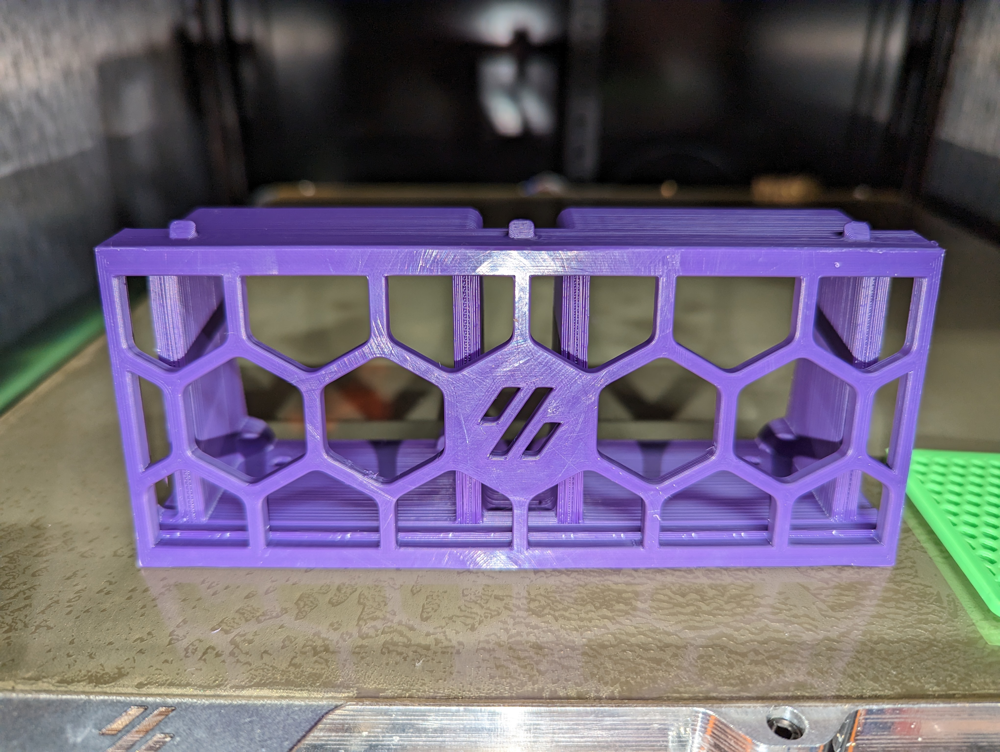
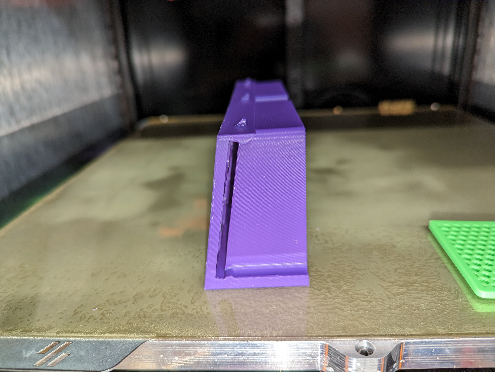

# 6020 Double Fan Mount

This adds a double fan mount for 60mm fans (60x20) in the center skirt section of the DoomCube.

The center skirt section on the DoomCube is the same size for 250/300/350, so it will fit all of them.

This mod keeps the slot in the side for the insert piece, which is the stock blank from the DoomCube repo.

File: [center_skirt_insert](https://github.com/FrankenVoron/DoomCube-2/blob/main/STLs/Skirts/Hexagon%20Skirts/%5Ba%5D_center_skirt_insert_x6.stl)

To get the mesh effect, slice it with these settings:

* 5-6 perimeters.
* 0 top and bottom layers
* Infill of your choice and density (30% shown for hex)

The back side of the skirt piece has holes to fit M4 threaded inserts, [M4x6.3x4.7](https://www.amazon.com/M4x4-7mm-OD6-3mm-Inserts-Plastic-Staking/dp/B08T9TXS9S).

You will need M4 25mm screws to attach the fans.

## Print Settings

Print in the orientation shown, but these options are required:

* Generate support material.
* Auto-Generated Supports
* Support on build plate only.

## Pictures

